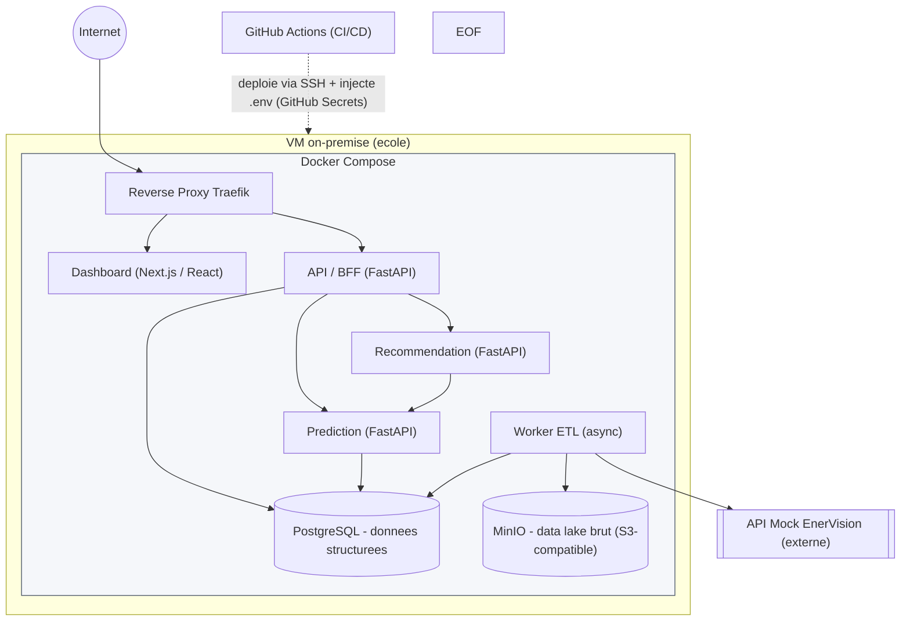
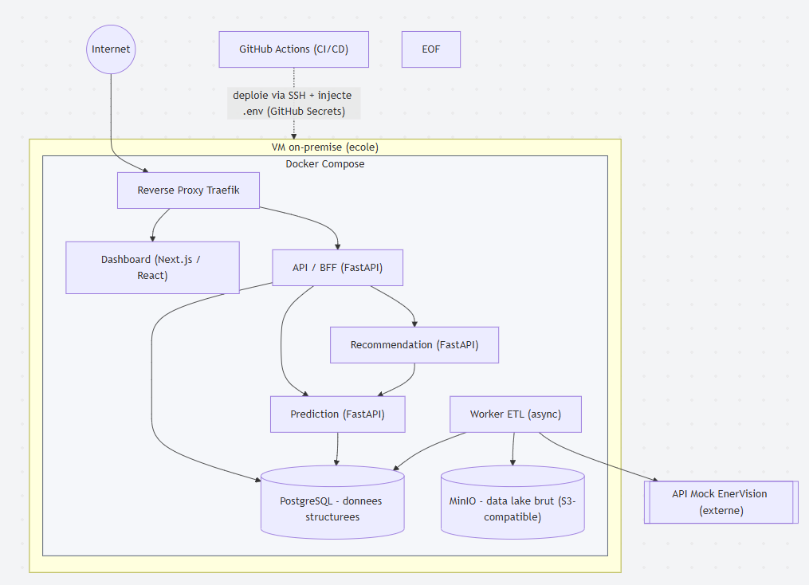

# EnerVision

## 1. Architecture infrastructure

Le système est déployé sur une seule VM on-premise mise à disposition par l'école, via Docker Compose. Cinq services applicatifs, une base relationnelle et un stockage objet compatible S3 tournent dans le même réseau Docker.

### Services :

API / BFF (FastAPI) - point d'entrée pour le dashboard, agrège les appels vers Prediction et Recommendation.
Recommendation (FastAPI) - règles à seuils, consomme les prédictions.
Prediction (FastAPI) - sert le modèle prédictif.
Worker ETL (async) - au lieu d'un déclenchement externe managé par le cloud, c'est un processus qui tourne en continu dans son propre conteneur et interroge l'API mock à intervalle régulier pour ingérer, transformer et charger les données. Il n'expose pas d'endpoint HTTP - ce n'est pas une API, c'est un worker.
Dashboard (Next.js/React).

### Stockage :

PostgreSQL pour les données structurées (sites, relevés, prédictions, recommandations).
MinIO pour le data lake brut - équivalent S3 auto-hébergé, API compatible S3 donc le code d'accès (SDK boto3 côté Python) ne change pas si un jour on migre vers un vrai S3.

Secrets : pas de Secrets Manager. En local, chaque service lit un .env (jamais commité, .env.example versionné pour le contenu attendu). En "prod" (la VM école), les valeurs sont stockées comme GitHub Secrets et injectées via le pipeline CI/CD au moment du déploiement SSH - donc aucun secret ne transite ni ne reste en clair sur la VM en dehors du .env généré au déploiement.

#### Mermaid

#### Diagramme

## Stockage

Le détail du socle de stockage (TimescaleDB + MinIO) est décrit dans
[docs/data-storage.md](docs/data-storage.md).

## Ingestion temps réel

Le worker de polling des sites (readings_raw + bucket bronze + Redis
Streams) est décrit dans [docs/ingestion-worker.md](docs/ingestion-worker.md).
