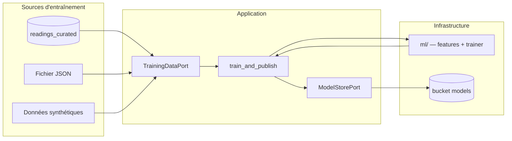
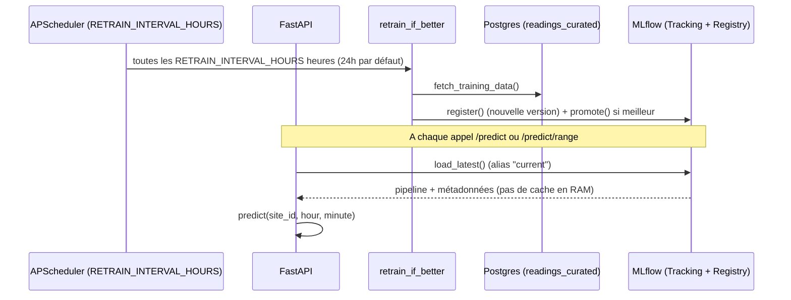

# Architecture du service Prediction

Le service suit une **architecture hexagonale** (ports & adapters), alignée
sur `core_api` et `etl_worker`. L'application ne dépend jamais directement
de SQLAlchemy, MinIO ou sklearn : elle passe par des interfaces (ports)
implémentées dans `infrastructure/`.

## Arborescence

```
apps/prediction/
├── main.py                         # Point d'entrée uvicorn
├── presentation/
│   └── api.py                      # FastAPI (/health)
├── application/
│   ├── ports/
│   │   ├── training_data_port.py   # TrainingDataPort
│   │   └── model_store_port.py     # ModelStorePort + SavedModelMetadata
│   └── train_and_publish.py        # Use case entraînement + publication
├── domain/                         # Vide (phase 1) — entités métier à venir
└── infrastructure/
    ├── config.py
    ├── training_data/              # Implémentations TrainingDataPort
    │   ├── factory.py
    │   ├── mock_reader.py
    │   ├── json_file_reader.py
    │   └── postgres_reader.py
    ├── model_store/                # Implémentations ModelStorePort
    │   ├── factory.py
    │   └── minio_store.py
    └── ml/                         # Feature engineering + entraînement sklearn
        ├── features.py
        ├── pipeline.py
        └── trainer.py
```

## Couches

### Presentation

Traduit le HTTP en appels applicatifs : `GET /`, `GET /health`, ainsi que
`GET /predict` et `GET /predict/range` (inférence). Aucune logique métier.

### Application

- **Ports** : contrats que l'infrastructure doit respecter.
- **Use cases** : orchestrent les ports sans connaître les détails techniques.

Deux use cases d'entraînement coexistent :
- `retrain_if_better()` — celui réellement câblé au cron APScheduler
  (`main.py`) : entraîne un candidat, le compare au champion actuel
  (MAE) et ne le promeut (réassigne l'alias MLflow) que s'il est meilleur.
- `train_and_publish()` — plus ancien, publie toujours le modèle entraîné
  sans comparaison ; conservé pour les scripts manuels
  (`tests/manual/manual_train_and_publish.py`) et testé isolément, mais
  plus utilisé par le service en production.

### Infrastructure

Implémentations concrètes des ports + pipeline ML. Les factories
(`create_training_data_reader`, `create_model_store`) choisissent
l'implémentation selon la configuration.

### Domain

Réservé pour les entités métier futures (`Prediction`, règles de validation).
Non utilisé en phase 1.

## Ports

### TrainingDataPort

```python
def fetch_training_data() -> pd.DataFrame
```

Retourne un DataFrame avec les colonnes `site_id`, `timestamp`,
`consumption_kwh`. Les lignes sans `consumption_kwh` sont exclues par
l'implémentation.

| Implémentation | Fichier | Usage |
|---|---|---|
| `MockTrainingDataReader` | `training_data/mock_reader.py` | Dev sans DB |
| `JsonFileTrainingDataReader` | `training_data/json_file_reader.py` | Export JSON local |
| `PostgresTrainingDataReader` | `training_data/postgres_reader.py` | Prod — table `readings_curated` |

**Source Postgres :** même stack que `CuratedWriter` (ETL) — SQLAlchemy sync
+ package partagé `db-schema` (`ReadingCurated`). Filtre SQL :
`consumption_kwh IS NOT NULL` (pas de filtre `data_quality`).

### ModelStorePort

```python
def save(pipeline, metadata) -> str                      # enregistre + promeut directement (train_and_publish)
def load_latest(model_name) -> (pipeline, metadata)       # modèle actuellement servi
def register(pipeline, metadata) -> str                   # enregistre sans promouvoir (champion/challenger)
def promote(model_name, version) -> None                  # fait de {version} le modèle servi
def get_current_metadata(model_name) -> metadata | None   # métadonnées du champion actuel
```

| Implémentation | Fichier | Usage |
|---|---|---|
| `MinioModelStore` | `model_store/minio_store.py` | Bucket `models` (S3-compatible) |
| `MlflowModelStore` | `model_store/mlflow_store.py` | Model Registry MLflow (voir [model-registry.md](model-registry.md)) |

Bascule via `MODEL_STORE` (`minio` si la variable n'est pas définie, mais
`docker-compose.yml` fixe explicitement `mlflow` pour le service
`prediction`) — les deux implémentations coexistent, aucune n'a été
supprimée.

**Structure MinIO :**

```
models/
  energy-consumption/
    2026-09-16T14-30-00Z/
      model.joblib
      metadata.json
    latest/                    ← pointeur pour le chargement au démarrage
      model.joblib
      metadata.json
```

## Flux de données (phase 1)



## Flux actuel (phase 2, implémentée)

Voir [docs/seq_prediction.md](../../../docs/seq_prediction.md) pour le
diagramme de séquence complet (cron de réentraînement + MLflow) et
[docs/seq_predict_call.md](../../../docs/seq_predict_call.md) pour l'appel
`/predict`.



## Écart avec la doc infra globale

| Composant | Doc cible (`archi_infra.md`) | État actuel |
|---|---|---|
| Source données | `readings_curated` | OK |
| Persistance modèle | MLflow → MinIO | `MlflowModelStore` actif par défaut (`MODEL_STORE=mlflow` dans docker-compose.yml) ; `MinioModelStore` reste disponible — voir [model-registry.md](model-registry.md) |
| Réentraînement | Cron interne | OK — `BackgroundScheduler` (APScheduler) dans `main.py`, `RETRAIN_INTERVAL_HOURS` (24h par défaut), pattern champion/challenger (`retrain_if_better.py`) |
| Inférence | `/predict` + modèle en RAM | `/predict` et `/predict/range` implémentés ; rechargent le modèle depuis MLflow à chaque appel (choix assumé, pas un écart à combler — voir `main.py` : rend une promotion visible immédiatement, sans redémarrage) |

Écart restant avec la doc cible : aucun cache mémoire entre les appels —
c'est un choix délibéré (voir ci-dessus), pas un TODO.

## Dépendances partagées

| Package | Rôle |
|---|---|
| `packages/db-schema` | ORM `ReadingCurated`, dialecte `postgresql+psycopg` |
| MinIO (SDK `minio`) | Stockage objet des modèles — mêmes variables d'env que l'ETL |
