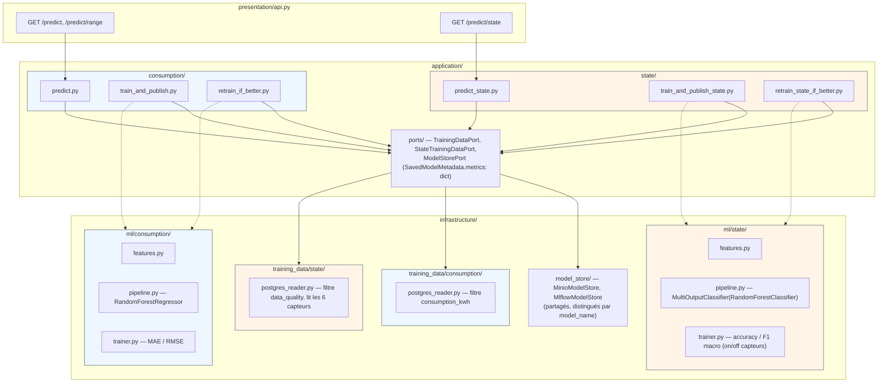
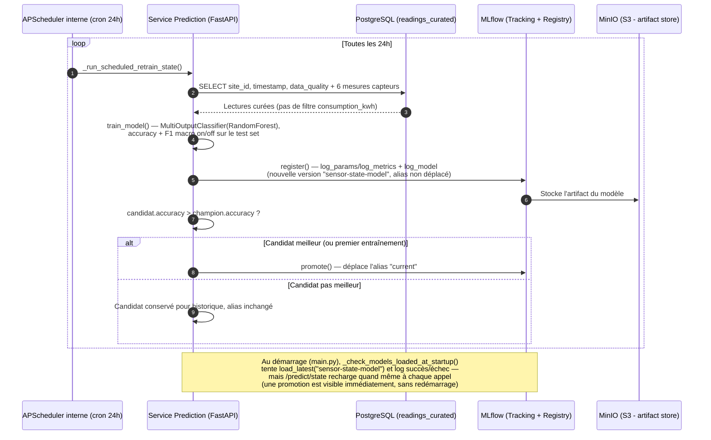
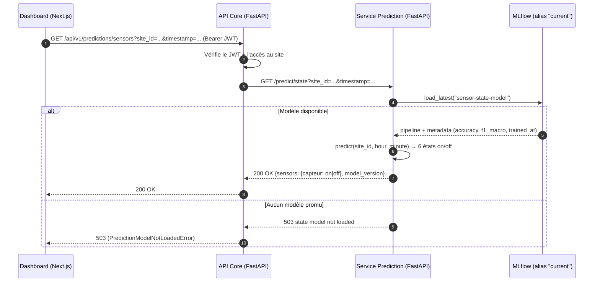

# Modèle d'état des capteurs (`sensor-state-model`)

Second modèle du service Prediction : prédit, pour un site à un instant
donné, si chacun de ses **6 capteurs** sera `on` ou `off` — une
**classification multi-sorties** (une sortie on/off par capteur),
contrairement au modèle de consommation qui fait de la **régression**. Chaque
capteur est prédit individuellement : il n'y a pas d'état global du site.
Voir aussi [ml-pipeline.md](ml-pipeline.md) (modèle
consommation) et [architecture.md](architecture.md) (arborescence complète).

## Ce que le modèle apprend

Chaque ligne de `readings_curated` porte 6 mesures (`consumption_kw`,
`voltage_v`, `current_a`, `power_factor`, `temperature_celsius`,
`humidity_percent`). Une mesure **nulle** signifie que le capteur est `off`
(panne ou donnée manquante), sinon `on`.

| | Contenu |
|---|---|
| **Entrées (features)** | `site_id`, heure, minute |
| **Sorties (cibles)** | 6 états on/off, un par capteur (`SENSOR_COLUMNS`) |
| **Algorithme** | `MultiOutputClassifier(RandomForestClassifier)` |

Le modèle apprend des habitudes du type « ce site perd souvent l'humidité
vers 11 h ». Il ne voit ni la météo ni l'état des capteurs juste avant : il
prédit à partir du site et de l'heure uniquement.

## Pourquoi un second modèle plutôt qu'étendre le premier ?

Les cibles sont de nature différente (états catégoriels on/off vs
`consumption_kwh` continu), donc deux pipelines sklearn différents et deux
jeux de métriques (accuracy/F1 vs MAE/RMSE). Les deux modèles partagent en revanche
la même infrastructure de stockage/versioning (`ModelStorePort`, MLflow,
MinIO) — voir le diagramme de package ci-dessous.

## Où vit le code (package par modèle, dans chaque couche)



## Entraînement et promotion (cron 24h, champion/challenger)

Même mécanique que le modèle de consommation
([seq_prediction.md](../../../docs/seq_prediction.md)), avec une métrique de
comparaison inversée : l'**accuracy** (part des états on/off de capteurs
correctement prédits) doit être plus **haute** pour promouvoir un candidat (le
MAE, lui, doit être plus **bas**).

Pour lancer un cycle à la demande, sans attendre le cron :

```bash
docker exec prediction python tests/manual/manual_retrain_state.py
```



## Appel `GET /predict/state`



## Métriques suivies

| Métrique | Modèle | Sens |
|---|---|---|
| `mae`, `rmse` | consumption | plus bas = meilleur |
| `accuracy`, `f1_macro` | state | plus haut = meilleur, calculés sur l'ensemble des états on/off de capteurs (F1 macro car un capteur est presque toujours `on` : l'accuracy seule serait trompeuse) |

Les deux sont stockées dans le même champ générique
`SavedModelMetadata.metrics: dict[str, float]`, journalisé tel quel dans
MLflow (`mlflow.log_metrics(metadata.metrics)`).

## Limites connues

- **Historique court** : le modèle ne connaît que les heures déjà observées ;
  il ne peut rien prédire de fiable sur les autres moments de la journée.
- **Pannes rares** (environ 7 % des mesures par capteur) : un modèle qui
  répondrait toujours `on` aurait une bonne accuracy, d'où le suivi du F1
  macro. La promotion se fait pour l'instant sur l'accuracy.
- **Ancien modèle** : un modèle enregistré avant ce changement prédisait un
  état global. `predict_state()` le refuse (503) tant qu'un ré-entraînement
  n'a pas promu un modèle par capteur.
