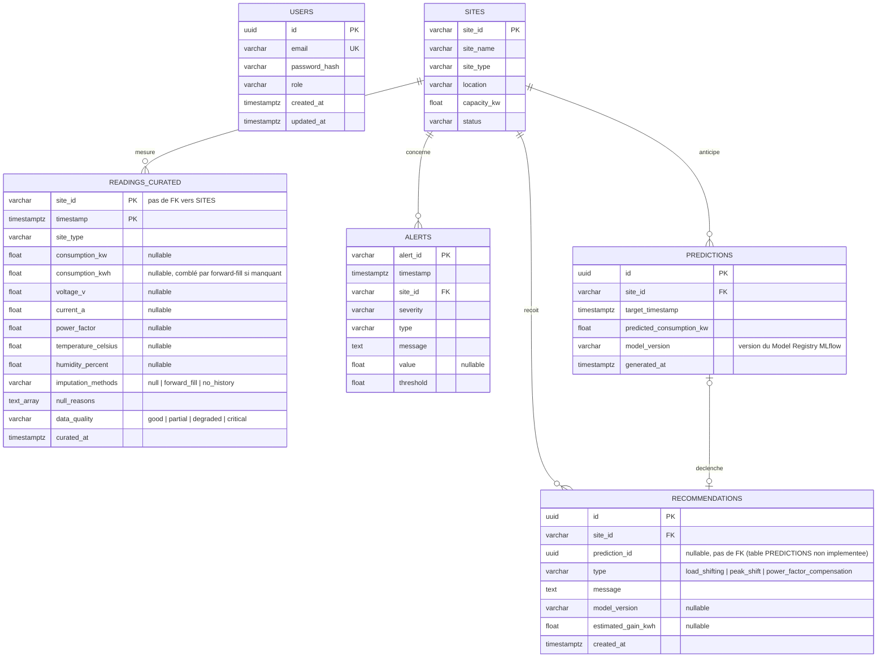

## 2. Schéma de la base de données postgres

Les tables ci-dessous existent réellement (schéma `enervision`, toutes
créées via Alembic — voir `packages/db-schema/alembic/versions/`, un
package partagé indépendant de toute app, installable par `core_api`,
`etl_worker` ou n'importe quel autre service) : clé naturelle `site_id`
(text, l'identifiant renvoyé par l'API mock, ex. `SITE001`), pas d'UUID —
plus simple à corréler directement avec les payloads de l'API et les
objets MinIO sans jointure supplémentaire. `USERS` et `PREDICTIONS`
restent des propositions non implémentées, à confirmer avec l'équipe ;
`RECOMMENDATIONS` est implémentée (voir plus bas).

SITES — les entités métier de base, telles que renvoyées par l'API mock : nom, type, capacité, localisation, statut.

READINGS_CURATED — table alimentée par le Worker ETL (voir [seq_etl.md](seq_etl.md)) : une ligne par lecture, upsert sur la clé naturelle `(site_id, timestamp)`. C'est une hypertable TimescaleDB. Une seule colonne par champ de mesure (sa valeur finale) — pas de colonne brute séparée. Seul `consumption_kwh` est éventuellement comblé par forward-fill si manquant (`imputation_methods` indique `null`/`forward_fill`/`no_history`) ; tous les autres champs gardent leur valeur brute telle quelle, `None` inclus. Pas de clé étrangère vers SITES (site_id est un simple champ texte, non contraint).

ALERTS — table créée par la migration (schéma prévu pour les alertes de consommation), mais **non alimentée à ce jour** : `core_api` relaie bien les alertes de l'API mock sur `GET /api/v1/alerts`, mais en pur proxy HTTP (aucune écriture Postgres). La détection d'alerte "data_quality dégradée/critique" en cours de conception passera par Redis Streams (`alert.detected`, voir la section Stockage ci-dessus), pas par cette table.

PREDICTIONS *(proposé)* — écrites par le worker/service Prediction toutes les 24h, avec model_version pour pouvoir tracer quelle version du modèle a produit quelle prédiction si vous voulez comparer plus tard.

RECOMMENDATIONS — générée et persistée par le service Recommendation (`GET /api/v1/recommendations?site_id=...`) : récupère la prédiction courante du site (appel HTTP au service Prediction), la capacité du site et son dernier facteur de puissance connu (`readings_curated`), applique le moteur de règles à seuils (décalage de charge, report de pic, compensation d'énergie réactive) et persiste chaque recommandation déclenchée. `model_version` et `estimated_gain_kwh` tracent respectivement la version du modèle ayant produit la prédiction source et le gain estimé (kWh) de la recommandation. `prediction_id` reste nullable et sans clé étrangère (la table `PREDICTIONS` n'existe pas encore) : une recommandation peut aussi naître d'un état courant critique sans passer par une prédiction persistée (ex. data_quality: critical détecté en direct) — pas seulement d'un pic anticipé.

USERS *(proposé)* — table d'authentification, volontairement isolée du reste : email (unique), password_hash (jamais le mot de passe en clair, bcrypt/argon2 côté FastAPI), role (ex. admin/viewer). Elle ne référence aucune autre table — c'est l'hypothèse que je veux qu'on confirme ensemble.

#### Mermaid

