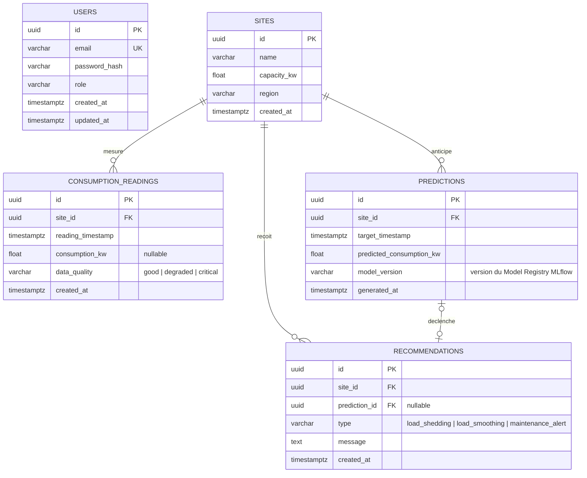
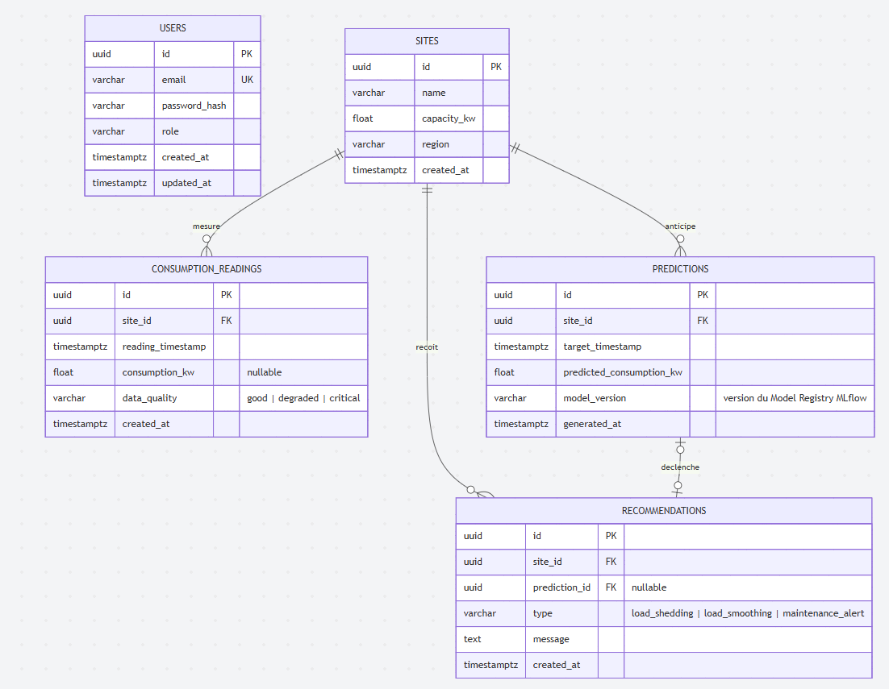

## 2. Schéma de la base de données postgres

5 tables, UUID en clé primaire partout (plus simple à générer côté application que des séquences, et ça évite de fuiter le volume de données via des IDs séquentiels si l'API est un jour publique).

USERS — table d'authentification, volontairement isolée du reste : email (unique), password_hash (jamais le mot de passe en clair, bcrypt/argon2 côté FastAPI), role (ex. admin/viewer). Elle ne référence aucune autre table — c'est l'hypothèse que je veux qu'on confirme ensemble ci-dessous.

SITES — les entités métier de base : nom, capacité, région. Point d'ancrage pour tout le reste.

CONSUMPTION_READINGS — les relevés bruts ingérés par le Worker ETL, avec consumption_kw nullable et data_quality (good/degraded/critical) pour refléter fidèlement ce que renvoie le mock, sans perdre l'information de dégradation.

PREDICTIONS — écrites par le worker/service Prediction toutes les 24h, avec model_version pour pouvoir tracer quelle version du modèle a produit quelle prédiction si vous voulez comparer plus tard.

RECOMMENDATIONS — prediction_id est nullable parce qu'une recommandation peut aussi naître d'un état courant critique sans passer par une prédiction (ex. data_quality: critical détecté en direct) — pas seulement d'un pic anticipé.

#### Mermaid

#### Diagramme

