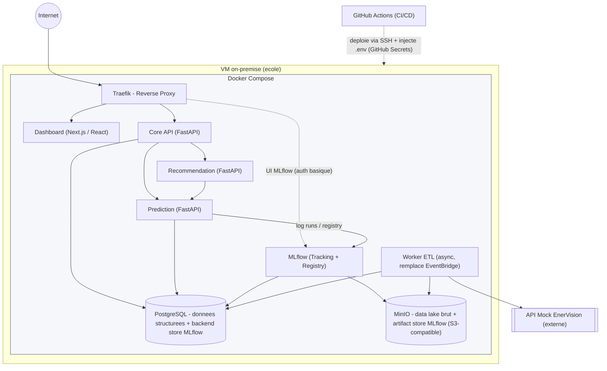

## 1. Architecture infrastructure

Le système est déployé sur une seule VM on-premise mise à disposition par l'école, via Docker Compose. Six services applicatifs, une base relationnelle et un stockage objet compatible S3 tournent dans le même réseau Docker.

### Services :

Core API (FastAPI) - point d'entrée pour le dashboard, agrège les appels vers Prediction et Recommendation.
Recommendation (FastAPI) - règles à seuils, consomme les prédictions.
Prediction (FastAPI) - sert le modèle prédictif, expose la route /predict qui lit un modèle gardé en mémoire (rechargé toutes les 24h). Un cron interne (APScheduler) réentraîne le modèle sur l'historique Postgres, log le run et enregistre le modèle dans MLflow, puis recharge la version "Production" en mémoire.
Worker ETL (async) - au lieu d'un déclenchement externe managé par le cloud, c'est un processus qui tourne en continu dans son propre conteneur et interroge l'API mock à intervalle régulier pour ingérer, transformer et charger les données. Il n'expose pas d'endpoint HTTP - ce n'est pas une API, c'est un worker.
MLflow (Tracking + Model Registry) - trace les entraînements (paramètres, métriques) et versionne les modèles produits par Prediction ; interrogé uniquement par ce dernier, avec une UI exposée pour le suivi et la démonstration.
Dashboard (Next.js/React).

### Stockage :

PostgreSQL pour les données structurées (sites, relevés, prédictions, recommandations) et pour le backend store de MLflow (runs, métriques, registre des versions) dans un schéma dédié - pas de base supplémentaire à opérer.
MinIO pour le data lake brut et pour l'artifact store de MLflow (fichiers de modèles entraînés) - équivalent S3 auto-hébergé, API compatible S3 donc le code d'accès (SDK boto3 côté Python) ne change pas si un jour on migre vers un vrai S3.

Secrets : pas de Secrets Manager. En local, chaque service lit un .env (jamais commité, .env.example versionné pour le contenu attendu). En "prod" (la VM école), les valeurs sont stockées comme GitHub Secrets et injectées via le pipeline CI/CD au moment du déploiement SSH - donc aucun secret ne transite ni ne reste en clair sur la VM en dehors du .env généré au déploiement. Les identifiants MinIO/Postgres utilisés par MLflow suivent le même mécanisme, aucune gestion de secrets distincte à mettre en place.

#### Mermaid

