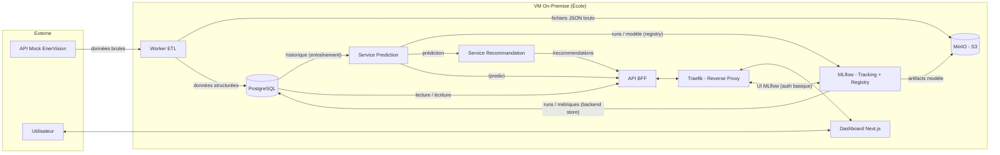
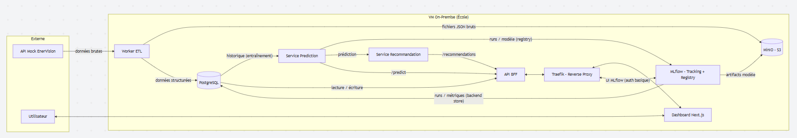

# Diagramme de flux des données

#### Mermaid

```mermaid
flowchart LR
    subgraph Externe["Externe"]
        Mock["API Mock EnerVision"]
        User["Utilisateur"]
    end
 
    subgraph VM["VM On-Premise (École)"]
        Traefik["Traefik - Reverse Proxy"]
        BFF["API BFF"]
        Pred["Service Prediction"]
        Reco["Service Recommandation"]
        ETL["Worker ETL"]
        MLflow["MLflow - Tracking + Registry"]
        MinIO[("MinIO - S3")]
        PG[("PostgreSQL")]
        Dash["Dashboard Next.js"]
    end
 
    Mock -- "données brutes" --> ETL
    ETL -- "fichiers JSON bruts" --> MinIO
    ETL -- "données structurées" --> PG
    PG -- "historique (entraînement)" --> Pred
    Pred -- "runs / modèle (registry)" --> MLflow
    MLflow -- "artifacts modèle" --> MinIO
    MLflow -- "runs / métriques (backend store)" --> PG
    Pred -- "prédiction" --> Reco
    PG -- "lecture / écriture" --> BFF
    Pred -- "/predict" --> BFF
    Reco -- "/recommendations" --> BFF
    BFF <--> Traefik
    Traefik <--> Dash
    Traefik <-- "UI MLflow (auth basique)" --> MLflow
    User <--> Dash
```

#### Diagramme

