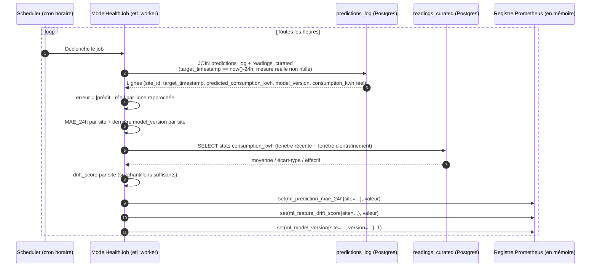

# Monitoring du modèle en production (drift + performance)

Implémenté : `predictions_log` (`packages/db-schema`), job
`ModelHealthJob` (`apps/etl_worker/application/model_health_job.py`,
`domain/model_health.py`), export Prometheus
(`apps/etl_worker/infrastructure/model_health_metrics.py`), dashboard
Grafana `model-health.json`, et un badge de drift dans le dashboard
métier `apps/dashboard` (relayé par `apps/core_api`, section 6). Complète
[monitoring.md](monitoring.md), qui ne couvre que l'infra, pas le modèle ML.

## Objectif

Démontrer que le modèle déployé (`apps/prediction`) est **surveillé**, pas
seulement déployé : dès qu'une prédiction est faite, on doit pouvoir dire a
posteriori si elle était bonne (MAE glissante), et détecter si les données
qu'on lui donne aujourd'hui ressemblent encore à celles sur lesquelles il a
été entraîné (drift).

## Vue d'ensemble

```
[Service Prediction] --predict()--> écrit --> [predictions_log] (Postgres)
                                                     |
[readings_curated]  --mesure réelle arrivée-->  [ModelHealthJob] (etl_worker, cron horaire)
                                                     |
                                         calcule MAE 24h glissante + drift
                                                     |
                                              [/metrics] (Prometheus)
                                                     |
                                     [Grafana : dashboard "Santé du modèle"]
```

Le rapprochement se fait dans `apps/etl_worker`, pas dans `apps/prediction` :
c'est déjà lui qui écrit `readings_curated` (la mesure réelle) et qui
possède le pattern de job planifié (`application/etl_job.py`, APScheduler).
`apps/prediction` se contente d'écrire dans `predictions_log` au moment de
l'inférence, sans connaître la suite.

## 1. Table `predictions_log`

Implémente la table `PREDICTIONS_LOG` (voir
[archi_database.md](archi_database.md#2-schéma-de-la-base-de-données-postgres)),
initialement esquissée comme *"proposée"* sous le nom `PREDICTIONS`.

| Colonne | Type | Description |
|---|---|---|
| `id` | uuid, PK | |
| `site_id` | varchar | Pas de FK vers `sites` (même convention que `readings_curated`) |
| `target_timestamp` | timestamptz | Instant pour lequel la prédiction a été faite |
| `predicted_consumption_kwh` | float | Valeur prédite |
| `model_version` | varchar | `metadata.trained_at` du modèle chargé (voir `application/predict.py:78`) |
| `generated_at` | timestamptz | Horodatage de l'appel `/predict` (`server_default=func.now()`) |

Écrite par `apps/prediction/presentation/api.py` (endpoint `/predict`), une
ligne par appel — pas de déduplication : si `/predict` est rappelé pour le
même `(site_id, target_timestamp)`, on garde l'historique des deux appels
(utile si le modèle a changé entre-temps).

`predict/range` n'écrit **pas** dans `predictions_log` dans cette première
version (volume potentiellement élevé, valeur métier plus faible pour le
rapprochement) — seul `/predict` (l'appel unitaire, utilisé pour une
échéance précise) est loggé.

## 2. Job de rapprochement (MAE glissante 24h)

`ModelHealthJob` (`apps/etl_worker/application/model_health_job.py`),
job APScheduler ajouté à côté de `EtlJob` dans `main.py`, même pattern
(classe avec `.run()`, dépendances injectables pour les tests) : tourne
toutes les `MODEL_HEALTH_INTERVAL_SECONDS` secondes (défaut 3600, soit
toutes les heures), pas à chaque cycle ETL (pas besoin d'une fraîcheur à
la minute pour une métrique glissante 24h). Ce même job calcule aussi le
drift (section 3) : un seul cycle couvre MAE + drift + export Prometheus.

Principe : pour chaque prédiction de `predictions_log` dont
`target_timestamp` tombe dans les 24 dernières heures et pour laquelle une
mesure réelle existe déjà dans `readings_curated` (jointure SQL sur
`site_id` + `timestamp = target_timestamp`, filtrée directement en base —
`ModelHealthReader.fetch_reconciled_predictions`), calculer :

```
erreur = |predicted_consumption_kwh - consumption_kwh|
```

Puis, par site, sur les prédictions dont `target_timestamp` est dans les
24 dernières heures :

```
MAE_24h(site) = moyenne(erreur) sur les prédictions rapprochées de ce site
```

### Mermaid



**Cas non rapprochables** : une prédiction dont la mesure réelle n'est
jamais arrivée (site en panne, `consumption_kwh` resté `None` après
imputation) reste orpheline — elle n'entre pas dans le calcul de MAE tant
qu'aucune valeur réelle n'existe. Pas de valeur par défaut ni d'imputation
de l'erreur : biaiserait la métrique de performance elle-même.

## 3. Détection de drift

### Ce qui dérive réellement ici

Point important : le modèle actuel (`apps/prediction/infrastructure/ml/features.py`)
n'utilise que **`site_id` + `hour` + `minute`** comme features — des
composantes calendaires déterministes, qui ne peuvent pas "dériver". Un
drift au sens classique (distribution des features d'entrée) n'a donc pas
de sens sur ces colonnes.

Le signal pertinent est la **distribution du signal réel de consommation**
(`consumption_kwh` dans `readings_curated`), par site : si le comportement
des sites change (nouvelle machine, saisonnalité non vue à l'entraînement,
panne de capteur qui change la distribution des valeurs), le modèle entraîné
sur l'ancienne distribution devient moins pertinent — même si ses features
d'entrée (heure/minute) restent, elles, inchangées.

### Calcul

Pour chaque site, comparer :
- **Fenêtre récente** : `consumption_kwh` des 24 dernières heures dans `readings_curated`.
- **Fenêtre d'entraînement** : `consumption_kwh` sur les `TRAINING_WINDOW_DAYS`
  jours (défaut 10, cohérent avec l'historique court mentionné dans
  `features.py`) précédant la date d'entraînement du modèle actif.

`etl_worker` ne dépend pas de MLflow/MinIO pour connaître cette date : elle
est reconstruite à partir de `model_version` (= `metadata.trained_at`,
format `%Y-%m-%dT%H-%M-%SZ`) déjà présent sur la prédiction rapprochée la
plus récente de chaque site dans `predictions_log`
(`infrastructure/model_health_reader.py:parse_model_version`) — recalculée
à la volée par requête sur `readings_curated`, pas de snapshot de stats
stocké côté MLflow. Si `model_version` ne correspond pas à ce format
(valeur absente ou legacy), le drift n'est pas calculé pour ce site sur ce
cycle plutôt que de faire planter le job.

```
z_mean(site) = (mean_24h(site) - mean_train(site)) / std_train(site)
z_std(site)  = std_24h(site) / std_train(site)

drift_score(site) = max(|z_mean(site)|, |z_std(site) - 1|)
```

### Seuil (à documenter et confirmer avec l'équipe)

| `drift_score` | Interprétation |
|---|---|
| < 1 | Distribution stable |
| 1 – 2 | Dérive modérée, à surveiller (pas d'alerte automatique dans cette première version) |
| > 2 | Dérive significative — le modèle a probablement besoin d'un ré-entraînement anticipé |

Seuil proposé : **2** (équivalent ~2 écarts-types), cohérent avec les seuils
statistiques usuels de détection d'anomalie simple. À valider avec l'équipe
avant mise en prod — pas de calibration sur données réelles à ce stade.

Un site avec moins de `MIN_SAMPLE_SIZE` points (défaut 30, sur la fenêtre
récente ou la fenêtre d'entraînement) ne produit pas de score fiable :
`drift_score` n'est pas exposé pour ce site tant que l'échantillon est
insuffisant (`domain/model_health.py:compute_drift_score`).

## 4. Exposition Prometheus

Nouvel endpoint `/metrics` sur `apps/etl_worker` (`prometheus_client`,
serveur HTTP séparé du scheduler APScheduler, même conteneur).

| Métrique | Type | Labels | Description |
|---|---|---|---|
| `ml_prediction_mae_24h` | Gauge | `site` | MAE glissante 24h, mise à jour à chaque cycle du job de rapprochement |
| `ml_feature_drift_score` | Gauge | `site` | Score de drift tel que défini ci-dessus |
| `ml_model_version` | Gauge (1 par version active) | `site`, `version` | Vaut `1` pour la version vue le plus récemment sur ce site (dernière prédiction rapprochée dans les 24h), permet de repérer un changement de version dans le temps via Grafana |

Déclaration de la cible `etl_worker:9200` dans
[monitoring/prometheus/prometheus.yml](../monitoring/prometheus/prometheus.yml)
(même pattern que les cibles existantes) — pas de port à publier côté hôte
(`docker-compose.yml` / `infra/monitoring.tf`) : comme `postgres-exporter`
ou `redis-exporter`, le scrape se fait sur le réseau Docker interne, `ETL_METRICS_PORT`
(défaut 9200) n'a besoin d'être exposé qu'à l'intérieur de `enervision-net`.

## 5. Panel Grafana « Santé du modèle »

Dashboard dédié `monitoring/grafana/dashboards/model-health.json` (uid
`enervision-model-health`), séparé de l'overview infra — la population de
lecteurs (data science / ML) est différente de celle de l'infra, et le
provisioning Grafana charge tout fichier du dossier `dashboards/`
automatiquement (pas de changement requis dans `dashboards.yml`).

| Panel | Requête | Pourquoi |
|---|---|---|
| MAE 24h par site | `ml_prediction_mae_24h` (time series, une ligne par `site`) | Voir la performance du modèle se dégrader progressivement, site par site |
| Score de drift par site | `ml_feature_drift_score` (time series + seuil visuel à 2) | Repérer visuellement quand un site franchit le seuil de dérive |
| Version du modèle active | `ml_model_version` (state timeline) | Corréler une variation brusque de MAE ou de drift avec un changement de version de modèle |

## 6. Badge de drift dans le dashboard métier (`apps/dashboard`)

À ne pas confondre avec l'« intervalle de confiance » d'une maquette de
prévision (incertitude autour d'un point prédit, pas encore implémentée) :
ce badge affiche le **statut de drift global du site**, tel que calculé
par `ModelHealthJob`.

`ml_feature_drift_score` ne vit qu'en mémoire dans le process
`etl_worker` (scrapée par Prometheus) — pour la rendre visible côté
utilisateur métier, `apps/core_api` interroge directement l'API HTTP de
Prometheus :

- [model_health_client.py](../apps/core_api/infrastructure/model_health_client.py)
  — `GET {PROMETHEUS_URL}/api/v1/query?query=ml_feature_drift_score{site="..."}`.
- Endpoint `GET /api/v1/model-health/drift?site_id=...` — traduit le score
  en statut (`stable` / `moderate` / `critical` / `unknown`) selon les
  mêmes seuils que la section "Seuil" ci-dessus (`DRIFT_MODERATE_THRESHOLD
  = 1.0`, `DRIFT_CRITICAL_THRESHOLD = 2.0` dans `presentation/api.py`).
  Ne renvoie jamais 502 : un score absent (Prometheus indisponible,
  échantillon insuffisant) est un statut normal (`unknown`), pas une panne.
- Dashboard : [DriftBadge.tsx](../apps/dashboard/src/components/features/prediction/DriftBadge.tsx),
  affiché dans l'en-tête de `PredictionSection.tsx`, alimenté par le hook
  [useModelDrift.ts](../apps/dashboard/src/hooks/prediction/useModelDrift.ts)
  (poll toutes les 5 minutes).

## Ce qui reste hors scope de cette première version

- Pas d'alerting automatique (Alertmanager) sur franchissement de seuil —
  seulement l'exposition de la métrique et la visualisation.
- Pas de déclenchement automatique de ré-entraînement sur drift détecté.
- `predict/range` n'alimente pas `predictions_log` (voir section 1).
- Le seuil de drift (2) n'est pas calibré sur données réelles — à ajuster
  après une période d'observation en prod.
