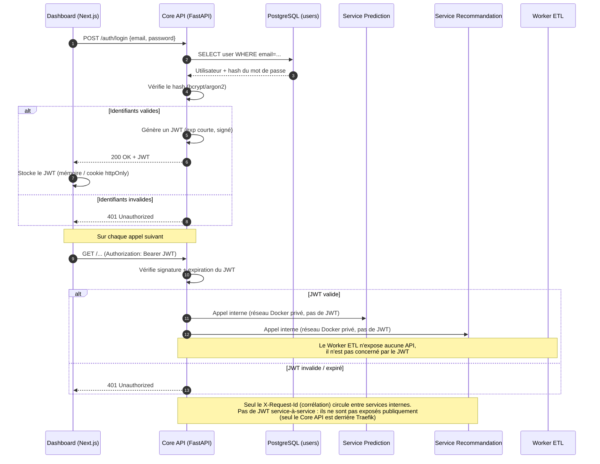

# Diagramme de séquence de l'authentification et du token JWT

#### Mermaid

```mermaid
sequenceDiagram
    autonumber
    participant Client as Dashboard (Next.js)
    participant Core as Core API (FastAPI)
    participant PG as PostgreSQL (users)
    participant Pred as Service Prediction
    participant Reco as Service Recommandation
    participant ETL as Worker ETL

    Client->>Core: POST /auth/login {email, password}
    Core->>PG: SELECT user WHERE email=...
    PG-->>Core: Utilisateur + hash du mot de passe
    Core->>Core: Vérifie le hash (bcrypt/argon2)
    alt Identifiants valides
        Core->>Core: Génère un JWT (exp courte, signé)
        Core-->>Client: 200 OK + JWT
        Client->>Client: Stocke le JWT (mémoire / cookie httpOnly)
    else Identifiants invalides
        Core-->>Client: 401 Unauthorized
    end

    Note over Client,Core: Sur chaque appel suivant
    Client->>Core: GET /... (Authorization: Bearer JWT)
    Core->>Core: Vérifie signature + expiration du JWT
    alt JWT valide
        Core->>Pred: Appel interne (réseau Docker privé, pas de JWT)
        Core->>Reco: Appel interne (réseau Docker privé, pas de JWT)
        Note over Core,ETL: Le Worker ETL n'expose aucune API,<br/>il n'est pas concerné par le JWT
    else JWT invalide / expiré
        Core-->>Client: 401 Unauthorized
    end

    Note over Core,Reco: Seul le X-Request-Id (corrélation) circule entre services internes.<br/>Pas de JWT service-à-service : ils ne sont pas exposés publiquement<br/>(seul le Core API est derrière Traefik)
```