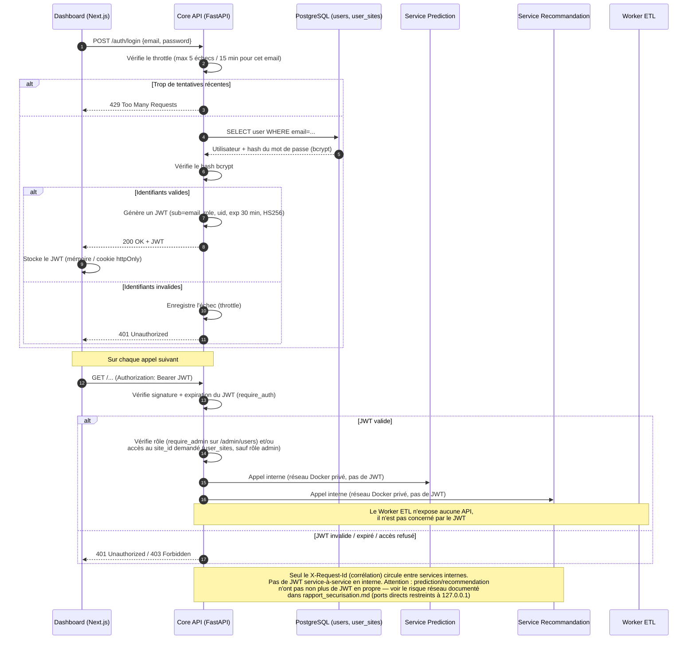

# Diagramme de séquence de l'authentification et du token JWT

> **Statut : implémenté.** Route `/auth/login`, table `users` (+
> `user_sites` pour l'accès par site) et vérification JWT sur toutes les
> routes métier de `core_api` (sauf `/`, `/health`, `/auth/login` et le
> flux SSE `/api/v1/alerts/stream`, voir note en bas de page) — voir
> `apps/core_api/presentation/api.py` et
> `apps/core_api/infrastructure/{auth,login_throttle,password_policy}.py`.
> Synthèse des preuves dans [rapport_securisation.md](rapport_securisation.md).

Le hash du mot de passe utilise **bcrypt** (pas argon2). Le JWT (algorithme
**HS256**, expiration configurable via `JWT_EXPIRE_MINUTES`, 30 min par
défaut) embarque `role` et `uid` dans le payload en plus du `sub` (email),
pour que `core_api` connaisse le rôle et les sites autorisés de l'appelant
sans aller-retour base à chaque requête (voir `_permitted_site_ids` dans
`presentation/api.py`). Deux niveaux de contrôle après vérification du JWT :
un rôle (`admin` vs les autres, routes `/admin/users`) et un scoping par
site (`user_sites`, table de jointure) pour les routes qui exposent un
`site_id`. La route `/auth/login` est protégée par un throttle (5 tentatives
échouées / 15 min par email, voir `infrastructure/login_throttle.py`) et la
création de compte par une politique de mot de passe alignée sur
l'ANSSI-PG-078 (longueur ≥ 12, pas de mot de passe courant/séquence évidente,
voir `infrastructure/password_policy.py`).

#### Mermaid

**Note — flux SSE non authentifié** : `/api/v1/alerts/stream` ne passe pas
par `require_auth` (le front s'y connecte via `EventSource`, qui ne permet
pas de porter un header `Authorization`). C'est une limitation technique
documentée, pas un oubli — voir le risque résiduel #3 dans
[rapport_securisation.md](rapport_securisation.md).