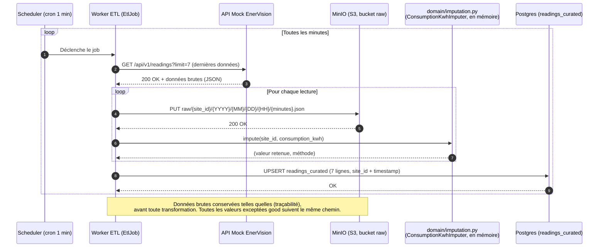

## Diagramme de séquence du Worker ETL

Implémenté dans `apps/etl_worker` : un seul job planifié (`EtlJob`,
`application/etl_job.py`), toutes les `ETL_POLL_INTERVAL_SECONDS` secondes
(60s par défaut, soit une minute). Pas de job séparé pour la
transformation — ingestion et curation se font dans le même passage,
lecture par lecture, sans jamais relire MinIO après coup.

### Mermaid

