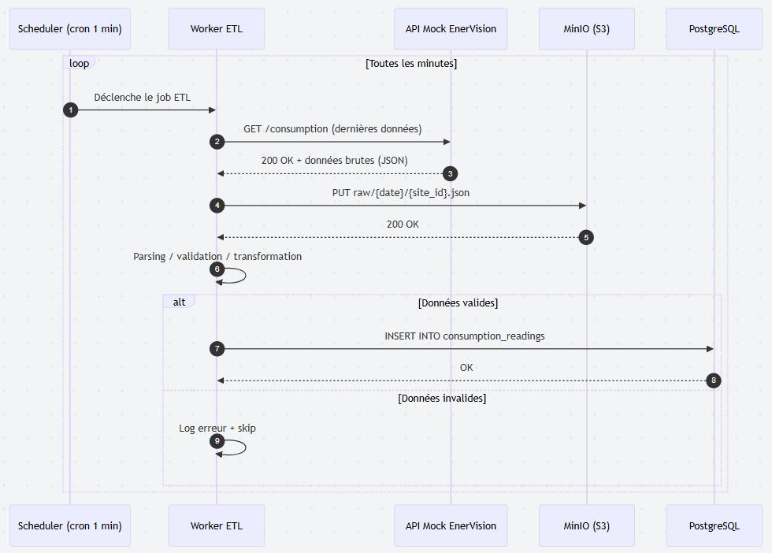

## Diagramme de séquence du Worker ETL

#### Mermaid

```mermaid
sequenceDiagram
    autonumber
    participant Cron as Scheduler (cron 1 min)
    participant Worker as Worker ETL
    participant Mock as API Mock EnerVision
    participant MinIO as MinIO (S3)
    participant PG as PostgreSQL

    loop Toutes les minutes
        Cron->>Worker: Déclenche le job ETL
        Worker->>Mock: GET /consumption (dernières données)
        Mock-->>Worker: 200 OK + données brutes (JSON)
        Worker->>MinIO: PUT raw/{date}/{site_id}.json
        MinIO-->>Worker: 200 OK
        Worker->>Worker: Parsing / validation / transformation
        alt Données valides
            Worker->>PG: INSERT INTO consumption_readings
            PG-->>Worker: OK
        else Données invalides
            Worker->>Worker: Log erreur + skip
        end
    end
EOFsequenceDiagram
    autonumber
    participant Cron as Scheduler (cron 1 min)
    participant Worker as Worker ETL
    participant Mock as API Mock EnerVision
    participant MinIO as MinIO (S3)
    participant PG as PostgreSQL

    loop Toutes les minutes
        Cron->>Worker: Déclenche le job ETL
        Worker->>Mock: GET /consumption (dernières données)
        Mock-->>Worker: 200 OK + données brutes (JSON)
        Worker->>MinIO: PUT raw/{date}/{site_id}.json
        MinIO-->>Worker: 200 OK
        Worker->>Worker: Parsing / validation / transformation
        alt Données valides
            Worker->>PG: INSERT INTO consumption_readings
            PG-->>Worker: OK
        else Données invalides
            Worker->>Worker: Log erreur + skip
        end
    end
```

#### Diagramme

