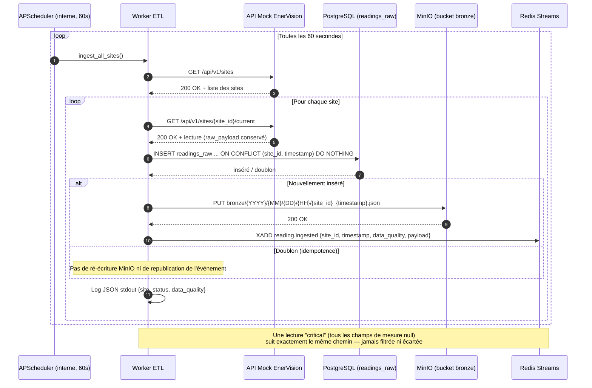
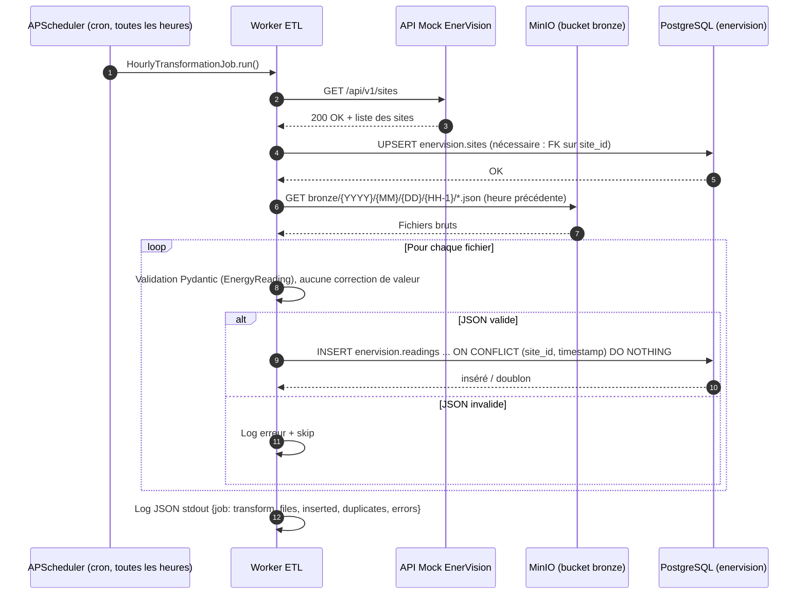

## Diagramme de séquence du Worker ETL

### Ingestion temps réel (issue #19)

Implémenté dans `apps/etl_worker` : un scheduler APScheduler interne au
worker (pas de cron externe) boucle toutes les 60 secondes sur tous les
sites retournés par l'API mock, et effectue une écriture double
idempotente avant de publier un événement — voir
[docs/ingestion-worker.md](ingestion-worker.md) pour le détail.

#### Mermaid

### Transformation horaire (bronze -> enervision.readings)

Second job APScheduler du même worker (cron, `minute=0`) : relit les
JSON bruts de l'heure précédente dans le bucket bronze et les charge
dans la table structurée `enervision.readings` (servie par core_api),
indépendamment de l'ingestion temps réel qui alimente déjà `readings_raw`.

#### Mermaid

