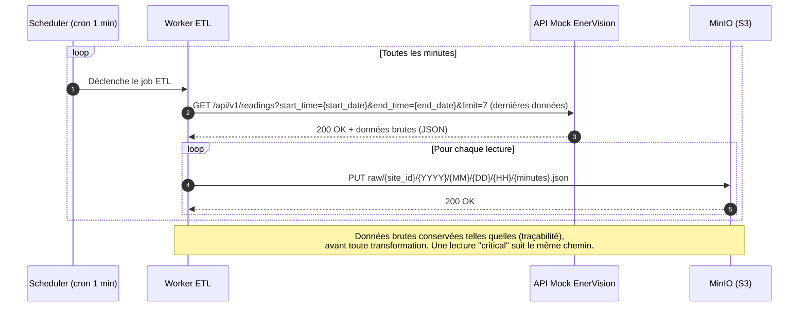

## Diagramme de séquence du Worker ETL

### Ingestion des données brutes

Implémenté dans `apps/etl_worker` : ce worker se limite à l'ingestion —
récupérer les dernières lectures et les déposer brutes dans MinIO.
L'insertion en base (`consumption_readings`) et la détection d'alerte
Redis sont traitées dans une branche séparée dédiée à la transformation.

#### Mermaid

