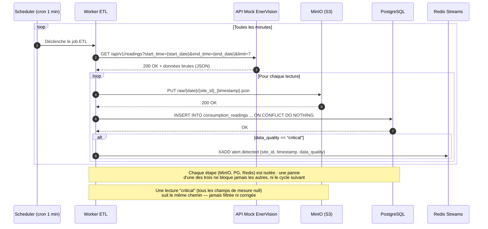

## Diagramme de séquence du Worker ETL

### Cycle ETL complet : ingestion, transformation et détection d'alertes

Un seul worker, un seul job planifié (toutes les minutes) : ingestion,
insertion en base et détection d'alerte se font dans le même cycle,
plutôt que sur deux jobs séparés (ingestion 1 min / transformation 1h).

#### Mermaid

