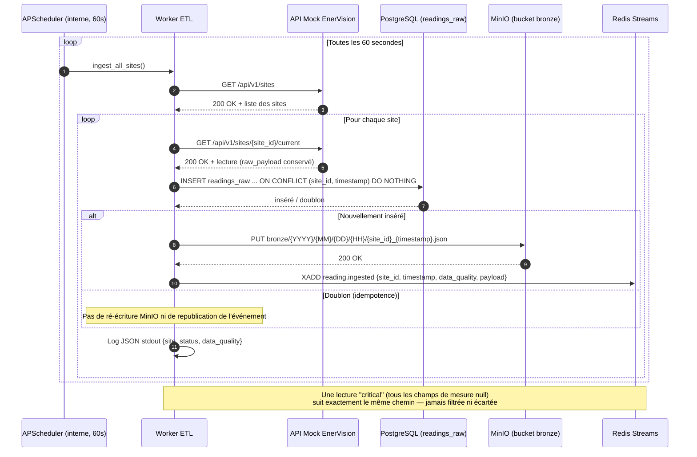
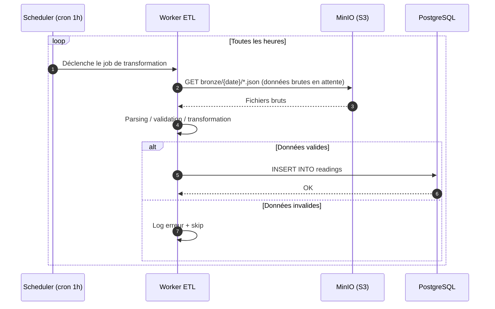

## Diagramme de séquence du Worker ETL

### Ingestion temps réel (issue #19)

Implémenté dans `apps/etl_worker` : un scheduler APScheduler interne au
worker (pas de cron externe) boucle toutes les 60 secondes sur tous les
sites retournés par l'API mock, et effectue une écriture double
idempotente avant de publier un événement — voir
[docs/ingestion-worker.md](ingestion-worker.md) pour le détail.

#### Mermaid

### Transformation des données brutes (à venir)

Étape distincte, pas encore implémentée : contrairement au plan initial,
l'ingestion (ci-dessus) écrit déjà directement dans `readings_raw` en
même temps que le JSON brut dans `bronze` — il n'y a pas de job séparé
qui relit MinIO pour peupler Postgres. Ce diagramme reste pertinent pour
un futur retraitement/backfill (ex. DATA-04, imputation) qui relirait le
bucket `bronze` indépendamment de l'ingestion temps réel.

#### Mermaid

