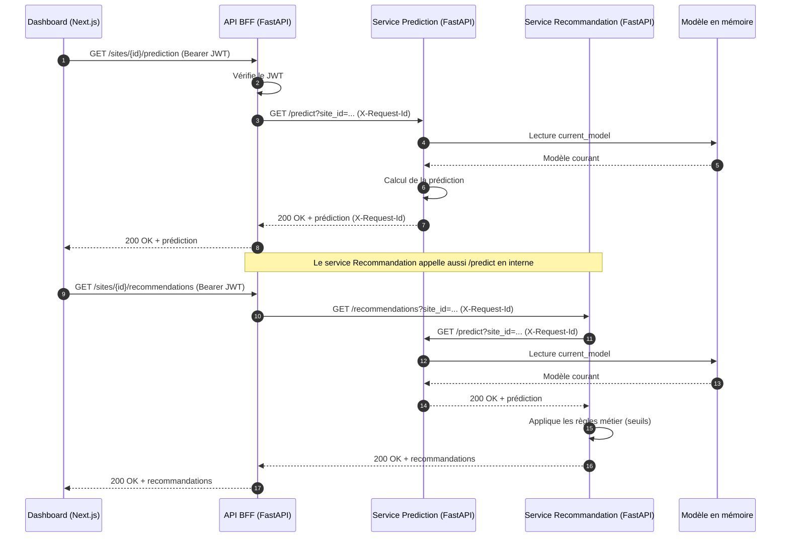
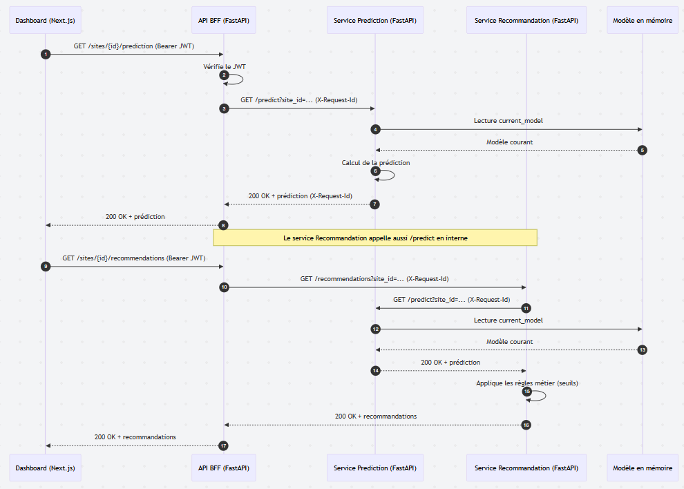

# Diagramme de séquence du appel au Service Prediction

#### Mermaid

```mermaid
sequenceDiagram
    autonumber
    participant Client as Dashboard (Next.js)
    participant BFF as API BFF (FastAPI)
    participant Pred as Service Prediction (FastAPI)
    participant Reco as Service Recommandation (FastAPI)
    participant Mem as Modèle en mémoire

    Client->>BFF: GET /sites/{id}/prediction (Bearer JWT)
    BFF->>BFF: Vérifie le JWT
    BFF->>Pred: GET /predict?site_id=... (X-Request-Id)
    Pred->>Mem: Lecture current_model
    Mem-->>Pred: Modèle courant
    Pred->>Pred: Calcul de la prédiction
    Pred-->>BFF: 200 OK + prédiction (X-Request-Id)
    BFF-->>Client: 200 OK + prédiction

    Note over BFF,Reco: Le service Recommandation appelle aussi /predict en interne
    Client->>BFF: GET /sites/{id}/recommendations (Bearer JWT)
    BFF->>Reco: GET /recommendations?site_id=... (X-Request-Id)
    Reco->>Pred: GET /predict?site_id=... (X-Request-Id)
    Pred->>Mem: Lecture current_model
    Mem-->>Pred: Modèle courant
    Pred-->>Reco: 200 OK + prédiction
    Reco->>Reco: Applique les règles métier (seuils)
    Reco-->>BFF: 200 OK + recommandations
    BFF-->>Client: 200 OK + recommandations
```

#### Diagramme

