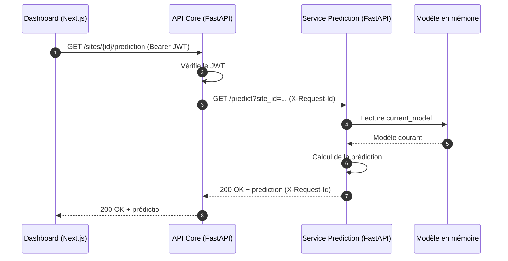
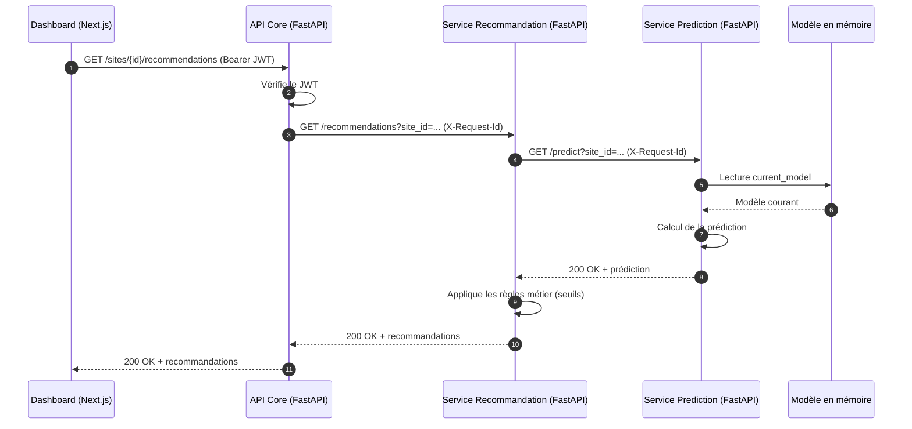

# Diagramme de séquence du appel au Service Prediction

## Appel au Service Prediction

#### Mermaid

```mermaid
sequenceDiagram
    autonumber
    participant Client as Dashboard (Next.js)
    participant Core as API Core (FastAPI)
    participant Pred as Service Prediction (FastAPI)
    participant Mem as Modèle en mémoire
 
    Client->>Core: GET /sites/{id}/prediction (Bearer JWT)
    Core->>Core: Vérifie le JWT
    Core->>Pred: GET /predict?site_id=... (X-Request-Id)
    Pred->>Mem: Lecture current_model
    Mem-->>Pred: Modèle courant
    Pred->>Pred: Calcul de la prédiction
    Pred-->>Core: 200 OK + prédiction (X-Request-Id)
    Core-->>Client: 200 OK + prédictio
```

### Appel au Service Recommandation

#### Mermaid

```mermaid
sequenceDiagram
    autonumber
    participant Client as Dashboard (Next.js)
    participant Core as API Core (FastAPI)
    participant Reco as Service Recommandation (FastAPI)
    participant Pred as Service Prediction (FastAPI)
    participant Mem as Modèle en mémoire
 
    Client->>Core: GET /sites/{id}/recommendations (Bearer JWT)
    Core->>Core: Vérifie le JWT
    Core->>Reco: GET /recommendations?site_id=... (X-Request-Id)
    Reco->>Pred: GET /predict?site_id=... (X-Request-Id)
    Pred->>Mem: Lecture current_model
    Mem-->>Pred: Modèle courant
    Pred->>Pred: Calcul de la prédiction
    Pred-->>Reco: 200 OK + prédiction
    Reco->>Reco: Applique les règles métier (seuils)
    Reco-->>Core: 200 OK + recommandations
    Core-->>Client: 200 OK + recommandations
```