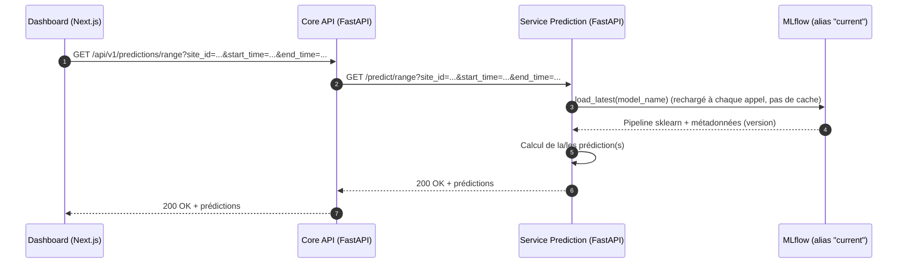
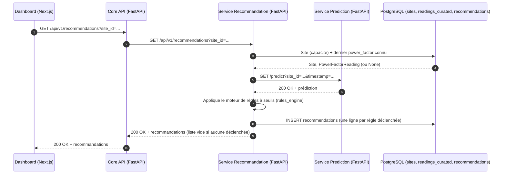

# Diagramme de séquence du appel au Service Prediction

> Aucune authentification n'est implémentée à ce jour sur `core_api` ni sur
> les services internes (pas de JWT, pas de clé API) — voir
> [seq_auth_token.md](seq_auth_token.md) pour le design proposé mais non
> câblé. Les échanges ci-dessous reflètent l'état réel : appels HTTP nus.

## Appel au Service Prediction

#### Mermaid

### Appel au Service Recommandation

#### Mermaid

