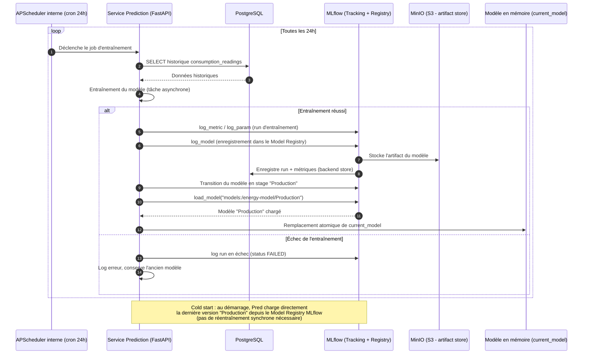
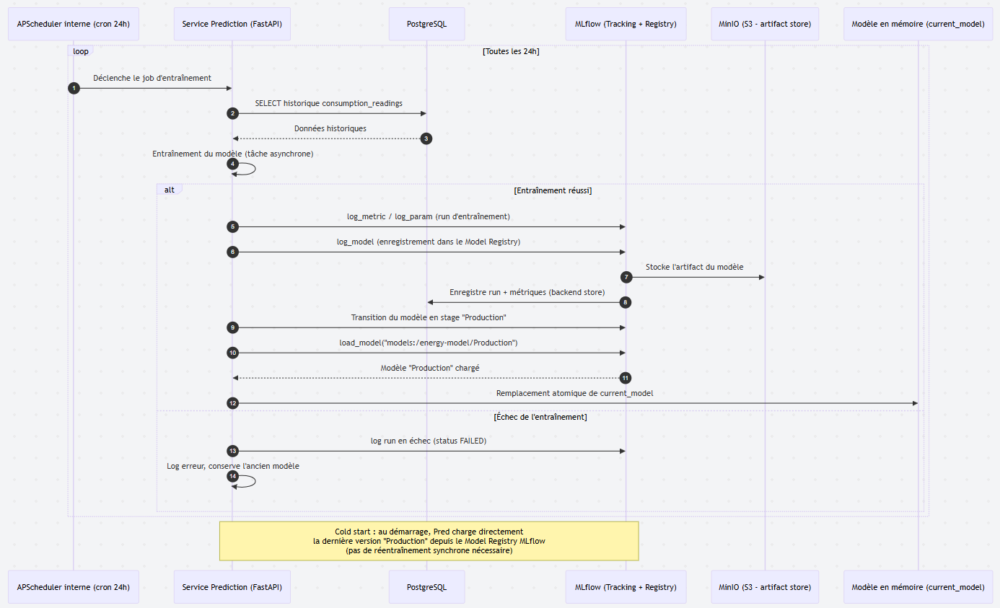

# Diagramme de sévquence du Service Prediction

#### Mermaid

```mermaid
sequenceDiagram
    autonumber
    participant Cron as APScheduler interne (cron 24h)
    participant Pred as Service Prediction (FastAPI)
    participant PG as PostgreSQL
    participant MLflow as MLflow (Tracking + Registry)
    participant MinIO as MinIO (S3 - artifact store)
    participant Mem as Modèle en mémoire (current_model)
 
    loop Toutes les 24h
        Cron->>Pred: Déclenche le job d'entraînement
        Pred->>PG: SELECT historique consumption_readings
        PG-->>Pred: Données historiques
        Pred->>Pred: Entraînement du modèle (tâche asynchrone)
        alt Entraînement réussi
            Pred->>MLflow: log_metric / log_param (run d'entraînement)
            Pred->>MLflow: log_model (enregistrement dans le Model Registry)
            MLflow->>MinIO: Stocke l'artifact du modèle
            MLflow->>PG: Enregistre run + métriques (backend store)
            Pred->>MLflow: Transition du modèle en stage "Production"
            Pred->>MLflow: load_model("models:/energy-model/Production")
            MLflow-->>Pred: Modèle "Production" chargé
            Pred->>Mem: Remplacement atomique de current_model
        else Échec de l'entraînement
            Pred->>MLflow: log run en échec (status FAILED)
            Pred->>Pred: Log erreur, conserve l'ancien modèle
        end
    end
 
    Note over Pred,MLflow: Cold start : au démarrage, Pred charge directement<br/>la dernière version "Production" depuis le Model Registry MLflow<br/>(pas de réentraînement synchrone nécessaire)
```

#### Diagramme

