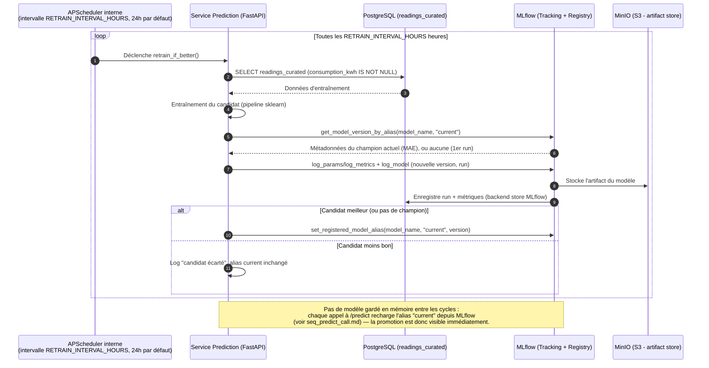

# Diagramme de séquence du Service Prediction

Implémenté dans `apps/prediction` : `main.py` démarre un `BackgroundScheduler`
(APScheduler) qui appelle `retrain_if_better()` toutes les
`RETRAIN_INTERVAL_HOURS` heures (24 par défaut), en tâche de fond dans le
même process que l'API FastAPI. Le candidat est toujours enregistré dans
MLflow (traçabilité), mais l'alias `current` (celui que `/predict` lit)
n'est réassigné que si son MAE bat celui du champion actuel — voir
`apps/prediction/application/retrain_if_better.py`.

#### Mermaid

